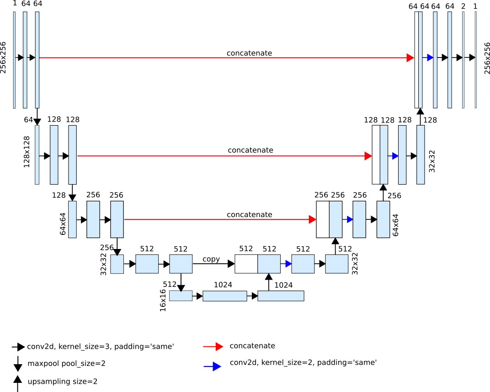

## Image_Segmentation
### Creating mask for morula images for extracting region of interest through image segmentation using unet model in pytorch.
 
### model architecture : 

### Results from the model : 

